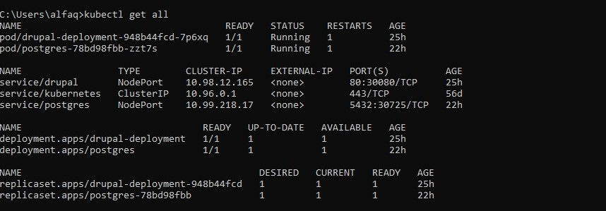
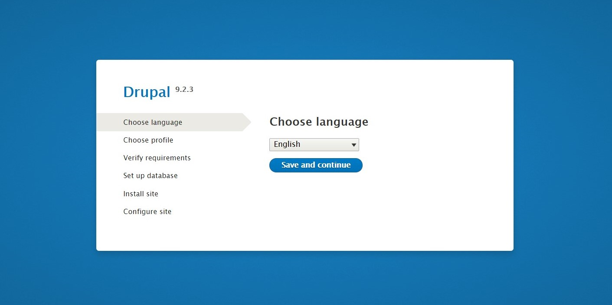
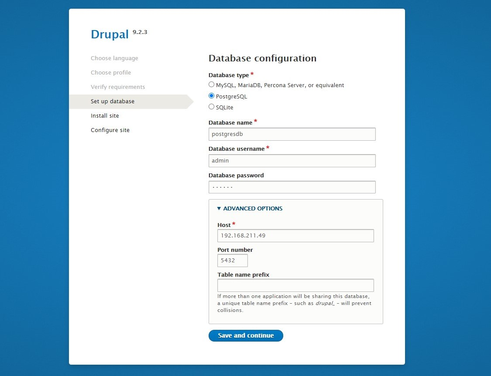
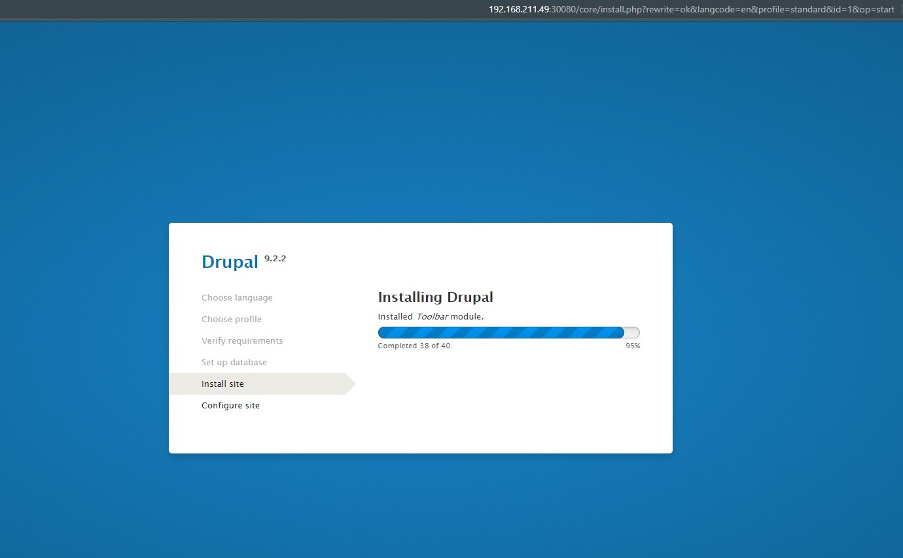
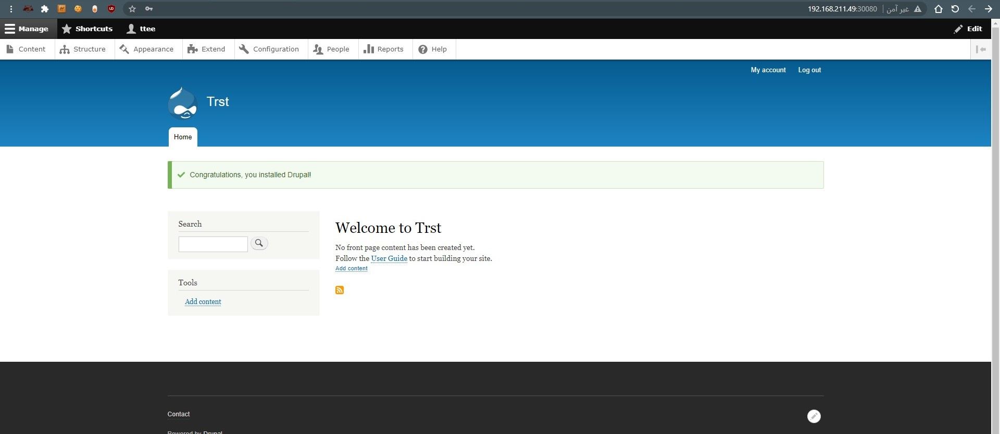

# Drupal-PostgreSQL-Kubernetes

[![LinkedIn][linkedin-shield]][linkedin-url]
[![Twitter][twitter-shield]][twittwe-url]
[![Twitter][github-shield]][github-url]


<!-- PROJECT LOGO -->
<p align="center">

  <h3 align="center"> Deploy PostgreSQL and Drupal by using Kubernetes </h3>


  <p align="center">
This yml files will setup a Drupal site using Kubernetes and Postgres
  </p>
  
# Steps
### 1. Clone the repo

Clone the `Drupal-PostgreSQL-Kubernetes` locally. In a terminal, run:

```
git clone https://github.com/Ahmad-Faqehi/Drupal-PostgreSQL-Kubernetes.git
```

### 2. Create Kubernetes cluster

Note: Minimum version 1.10 is required for both Kubernetes server and kubectl client.

### 3. Create the service and deployment

Either run this commands listed in it:

```shell
kubectl apply -f local-volumes.yaml
kubectl apply -f drupal-deployment.yaml
kubectl apply -f postgres-storage.yaml
kubectl apply -f postgres-deployment.yaml
kubectl apply -f postgres-service.yaml
```

### 4. Access Drupal

After deploying, we need to be sure that all pods are running. Check on the status via:

```shell
kubectl get all
```

Once all pod are running we need to know the IP address of our Drupal.
* []() All running <br>


<Br/>
open your localhost ip with port 30080

```shell
localhost:30080
```

the login info for Postgres is
```shell
Database Name: postgresdb
Database Username: admin
Database Password: 123456
```


<!-- USAGE EXAMPLES -->
## Screenshots


* []() Setup Page for drupal <br>



* []() Here should enter the `local ip` for your system  <br>



* []() Dashboard Elements Page <br>


* []() Dashboard Evaluation Page <br>



<!-- CONTACT -->
## Contact

Ahmad Faqehi - [@A_F775](https://twitter.com/A_F775) - alfaqehi775@gmail.com

Project Link: [https://github.com/Ahmad-Faqehi/Donor-Registration-System](https://github.com/Ahmad-Faqehi/Donor-Registration-System)


<!-- MARKDOWN LINKS & IMAGES -->
<!-- https://www.markdownguide.org/basic-syntax/#reference-style-links -->
[linkedin-shield]: https://img.shields.io/badge/-LinkedIn-black.svg?style=for-the-badge&logo=linkedin&colorB=555
[linkedin-url]: https://linkedin.com/in/ahmad-faqehi
[twitter-shield]: https://img.shields.io/badge/-twitter-black.svg?style=for-the-badge&logo=twitter&colorB=555
[twittwe-url]: https://twitter.com/A_F775
[github-shield]: https://img.shields.io/badge/-github-black.svg?style=for-the-badge&logo=github&colorB=555
[github-url]: https://github.com/Ahmad-Faqehi
